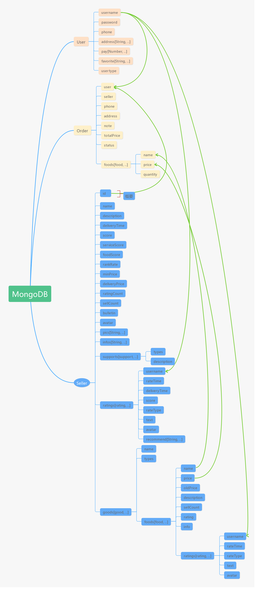

# Take-Away-AS
Project for Web Application Development 2

[Demo](https://www.youtube.com/watch?v=g8oSENvYg0g&feature=youtu.be)

- [Take-Away-AS](#take-away-as)
  * [Basic Inforamtion](#basic-inforamtion)
  * [Environment](#environment)
  * [Usage](#usage)
  * [Structure of Database](#structure-of-database)
  * [Brief Description of Functionality](#brief-description-of-functionality)
  * [Persistence Approach](#persistence-approach)
  * [Git Approach](#git-approach)
  * [DX (Developer eXperience) Approach](#dx--developer-experience--approach)
  * [References](#references)

<small><i><a href='http://ecotrust-canada.github.io/markdown-toc/'>Table of contents generated with markdown-toc</a></i></small>

## Basic Inforamtion
- ID: 20086454
- Name: Qianxiong Xu

## Environment
- OS: Windows 10
- Node: v10.16.3

## Usage
- Clone:
```
git clone https://github.com/Sam1224/Take-Away-AS.git
```
- Configure:
```
cd <your_dir>
npm install
```
- Run:
```
npm run build:release
npm run start:prod
```
- Test (if the test failed and get a notice like `...exceed 6000ms...`, go to `package.json` and find the `test script`, modify the value after `--timeout` into a larger value, like `10000`):
```
// test all three routes
npm run test
// test user router
npm run test:user
// test seller router
npm run test:seller
// test order router
npm run test:order
```
- Generate coverage report:
```
npm run test:report
```

## Structure of Database


## Brief Description of Functionality
This project is a backend of a take-away app, it could do some basic `CRUD` operations.

It uses `jsonwebtoken` as a way of authentication, each api that needs authentication should put a token in the request body to be verified.

It could be roughly divided into 3 parts: `user`, `seller` and `order` (3 corresponded models), there are `28` RESTful apis in total, with `8 GET`, `9 POST`, `4 PUT` and `7 DELETE`. They are listed as follow:
- `user` (./routes/user.js)
    - GET       -   findAll
        - Return a list of all users.
        - No need for jwt authentication.
        - `localhost:3000/user`
    - GET       -   findOne
        - Return one user by `id`.
        - No need for jwt authentication.
        - `localhost:3000/user/:id`
    - POST      -   addUser
        - Add a new user.
        - No need for jwt authentication.
        - `localhost:3000/user`
            - `username`:   'xxx'
            - `password`:   'xxx' (password will be encrypted by `sha1`)
            - `phone`:      xxx
    - PUT       -   updateUser
        - Update the password and phone of a user.
        - Need jwt authentication.
        - `localhost:3000/user`
            - `username`:   'xxx'
            - `password`:   'xxx'
            - `phone`:      xxx
            - `token`:      'xxx'
    - POST      -   login
        - Login and get the jwt token.
        - The api invoked to get the jwt token, no need itself.
        - `localhost:3000/login`
            - `username`:   'xxx'
            - `password`:   'xxx'
    - DELETE    -   deleteUser
        - Delete one user by `id`.
        - No need for jwt authentication.
        - `localhost:3000/user/:id`
    - POST      -   addAddress
        - Add one address to the address list of a user identified by `username`.
        - Need jwt authentication.
        - `localhost:3000/user/address`
            - `username`:   'xxx'
            - `address`:    'xxx'
            - `token`:      'xxx'
    - DELETE    -   deleteAddress
        - Delete one address from the address list of a user identified by `username`.
        - Need jwt authentication.
        - `localhost:3000/user/address`
            - `username`:   'xxx'
            - `address`:    'xxx'
            - `token`:      'xxx'
    - POST      -   addPay
        - Add one bank card to the payment list of a user identified by `username`.
        - Need jwt authentication.
        - `localhost:3000/user/pay`
            - `username`:   'xxx'
            - `pay`:        'xxx'
            - `token`:      'xxx'
    - DELETE    -   deletePay
        - Delete one bank card from the payment list of a user identified by `username`.
        - Need jwt authentication.
        - `localhost:3000/user/pay`
            - `username`:   'xxx'
            - `pay`:        'xxx'
            - `token`:      'xxx'
    - POST      -   addFavorite
        - Add one seller id to the favorite list of a user identified by `username`.
        - Need jwt authentication.
        - `localhost:3000/user/favorite`
            - `username`:   'xxx'
            - `favorite`:   'xxx'
            - `token`:      'xxx'
    - DELETE    -   deleteFavorite
        - Delete one seller id from the favorite list of a user identified by `username`.
        - Need jwt authentication.
        - `localhost:3000/user/favorite`
            - `username`:   'xxx'
            - `favorite`:   'xxx'
            - `token`:      'xxx'
- `seller` (./routes/seller.js)
    - GET       -   findAll
        - Return a list of all sellers.
        - No need for jwt authentication.
        - `localhost:3000/seller`
    - GET       -   findOne
        - Return one seller by `id`.
        - No need for jwt authentication.
        - `localhost:3000/seller/:id`
    - POST      -   addSeller
        - Add a new seller.
        - Need jwt authentication.
        - `localhost:3000/seller`
            - `name`:           'xxx'
            - `description`:    'xxx'
            - `deliveryTime`:   30
            - `bulletin`:       'xxx'
            - `supports`:       [{'types': 1, 'description': 'xxx'}, ...]
            - `avatar`:         'url'
            - `pics`:           ['xxx', ...]
            - `infos`:          ['xxx', ...]
            - `token`:          'xxx'
    - PUT       -   updateSeller
        - Modify the basic information of a seller identified by `id`.
        - Need jwt authentication.
        - `localhost:3000/seller/:id`
            - `name`:           'xxx'
            - `description`:    'xxx'
            - `deliveryTime`:   40
            - `bulletin`:       'xxx'
            - `supports`:       [{'types': 0, 'description': 'xxx'}, ...]
            - `avatar`:         'url'
            - `pics`:           ['xxx', ...]
            - `infos`:          ['xxx', ...]
            - `token`:          'xxx'
    - DELETE    -   deleteSeller
        - Delete one seller identified by `id`.
        - Need jwt authentication.
        - `localhost:3000/seller/:id`
            - `token`:  'xxx'
    - PUT       -   updateGoods
        - Update the information of goods of a seller identified by `id`.
        - Need jwt authentication.
        - `localhost:3000/seller/:id/goods`
            - `goods`: [{
                'name': 'Hot sales',
                'types': -1,
                'foods': [{
                    'name': 'xxx',
                    'price': 10,
                    'oldPrice': '',
                    'description': 'xxx',
                    'info': '',
                    'icon': 'url',
                    'image': 'url'
                }, ...]
            }, ...]
            - `token`: 'xxx'
    - POST      -   addRating
        - Add one rating to the rating list of a user identified by `id`.
        - Need jwt authentication.
        - `localhost:3000/seller/:id/ratings`
            - `username`:       'xxx',
            - `deliveryTime`:   30,
            - `score`:          5,
            - `rateType`:       0,
            - `text`:           'xxx',
            - `avatar`:         'url',
            - `recommend`:      ['xxx', ...]
            - `token`:          'xxx'
    - DELETE    -   deleteRating
        - Delete one rating from the rating list of a user identified by `id`.
        - Need jwt authentication.
        - `localhost:3000/seller/:id/ratings`
            - `username`:       'xxx',
            - `deliveryTime`:   30,
            - `score`:          5,
            - `rateType`:       0,
            - `text`:           'xxx',
            - `avatar`:         'url',
            - `recommend`:      ['xxx', ...]
            - `token`:          'xxx'
    - POST      -   fuzzySearch
        - Fuzzy search for sellers.
        - No need for jwt authentication.
        - `localhost:3000/seller/search`
            - `keyword`: 'xxx'
- `order` (./routes/order.js)
    - GET       -   findAll
        - Return a list of all orders.
        - Need jwt authenticattion.
        - `localhost:3000/order`
            - `token`:  'xxx'
    - GET       -   findOne
        - Return one order identified by `id`.
        - Need jwt authentication.
        - `localhost:3000/order/:id`
            - `token`:  'xxx'
    - GET       -   findAllByUser
        - Return a list of all orders belong to one user identified by `id`.
        - Need jwt authentication.
        - `localhost:3000/order/user/:id`
            - `token`:  'xxx'
    - GET       -   findAllBySeller
        - Return a list of all orders belong to one seller identified by `id`.
        - Need jwt authentication.
        - `localhost:3000/order/seller/:id`
            - `token`:  'xxx'
    - POST      -   addOrder
        - Create a new order.
        - Need jwt authentication.
        - `localhost:3000/order`
            - `user`: 'xxx'
            - `seller`: 'xxx'
            - `address`: ''
            - `phone`: xxx
            - `note`: 'xxx'
            - `foods`: [{
                          'name': 'xxx',
                          'price': 10,
                          'quantity': 2
                      }, ...]
            - `token`: 'xxx'
    - DELETE    -   deleteOrder
        - Delete one order identified by `id`.
        - Need jwt authentication.
        - `localhost:3000/order/:id`
            - `user`: 'xxx'
            - `seller`: 'xxx'
            - `address`: ''
            - `phone`: xxx
            - `note`: 'xxx'
            - `foods`: [{
                          'name': 'xxx',
                          'price': 10,
                          'quantity': 2
                      }, ...]
            - `token`: 'xxx'
    - PUT       -   commentOrder
        - Comment for one order identified by `id`.
        - Need jwt authentication.
        - `localhost:3000/order/:id`
            - `seller`: 'xxx',
            - `username`: 'xxx'
            - `deliveryTime`: 30
            - `score`: 5
            - `rateType`: 0
            - `text`: ''
            - `avatar`: 'url'
            - `recommend`: ['xxx', ...]
            - `token`: 'xxx'

## Persistence Approach
- App:
The whole project is deployed to [Heroku](https://www.heroku.com).
- MongoDB:
The MongoDB is deployed by using `mLab MongoDB sandbox` provided by [Heroku](https://www.heroku.com).
- Authentication:
The project uses `jsonwebtoken` as a way of authentication, each api that needs authentication should put a token in the request body to be verified.

## Git Approach
- This project adopts `Git bash` locally, while using `Github` as the remote repository for management.
- Url to the repository: https://github.com/Sam1224/Take-Away-AS
```
git clone https://github.com/Sam1224/Take-Away-AS.git
```
- The status of this repository is `public`.
- Please refer to the `git log` for my commiting records.

## DX (Developer eXperience) Approach
- Automated testing:
    - Using `mocha` and `lodash` to do automated testing.
    - There are `86` test cases in total.
- Code quality:
    - Using `eslint` to check and obey the `code standard`.
    - Using `nyc` to generate `code coverage report`.
- Others:
    - Using `babel` to `compile` and support `es6 grammar`.
    - Using `cross-env` to enable `platform independence`.
    - Using `nodemon` and `eslint-watch` to `watch` the `file changes` of a project and perform `hot reboot`.

## References
- [Mr. David Drohan's course](https://tutors-design.netlify.com/course/wit-wad-2-2019.netlify.com)
- [Node.js](https://nodejs.org/zh-cn/)
- [Node's official docs](https://nodejs.org/zh-cn/docs/)
- [MongoDB](https://www.mongodb.com/)
- [MongoDB Atlas](https://www.mongodb.com/cloud/atlas)
- [Mongoose](https://mongoosejs.com/)
- [Mongoose docs](http://www.nodeclass.com/api/mongoose.html#quick_start)
- [sha1](https://www.npmjs.com/package/js-sha1)
- [A blog of MongoDB about Schema and Model](https://www.jianshu.com/p/29c55aae3d6f)
- [mocha](https://mochajs.org/)
- [A blog about Mocha](http://www.ruanyifeng.com/blog/2015/12/a-mocha-tutorial-of-examples.html)
- [lodash](https://lodash.com/)
- [eslint](https://eslint.org/)
- [jsonwebtoken](https://www.npmjs.com/package/jsonwebtoken)
- [A blog about jwt](http://www.ruanyifeng.com/blog/2018/07/json_web_token-tutorial.html)
- [A blog about jwt](https://www.jb51.net/article/162523.htm)
- [A blog about jwt](https://segmentfault.com/a/1190000014062679?utm_source=tag-newest)
- [chai](https://www.chaijs.com/)
- [supertest](https://github.com/visionmedia/supertest)
- [Mongodb-Memory-Server](https://github.com/nodkz/mongodb-memory-server)
- [nyc](https://github.com/istanbuljs/nyc)
- [Postman](https://www.getpostman.com/)
- [TOC generator](https://ecotrust-canada.github.io/markdown-toc/)

